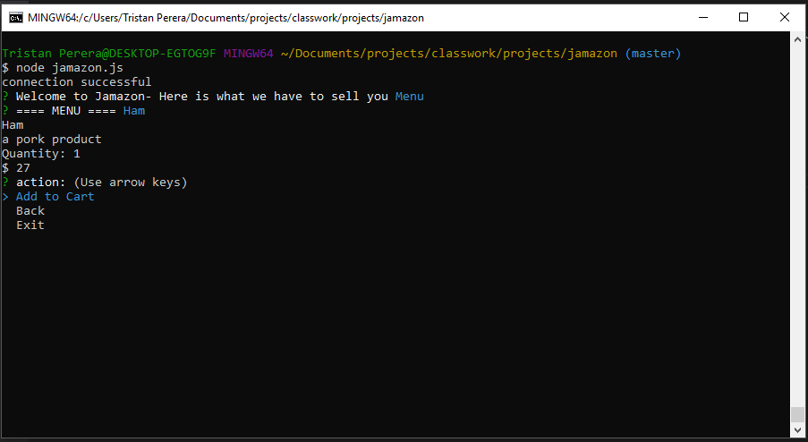

# Jamazon
## an Online Store By trizCA

This app was created to show my ability to create a terminal based online store with a MySQL database 

# Features
- A menu system dynamically creating a menu with up to date information
- A shopping cart that allows you to add product. It shows what is in your cart along with your cart total
- A checkout system that shows what hte customer is buying and updates the database (if we were accepting payment, this is where it would be)

# How to use
This system is pretty straight forward and intuitive, follow the terminal menu and commands

# Technology Used
- Javascript
- MySQL
- NodeJS
- NPM

# Screenshot
